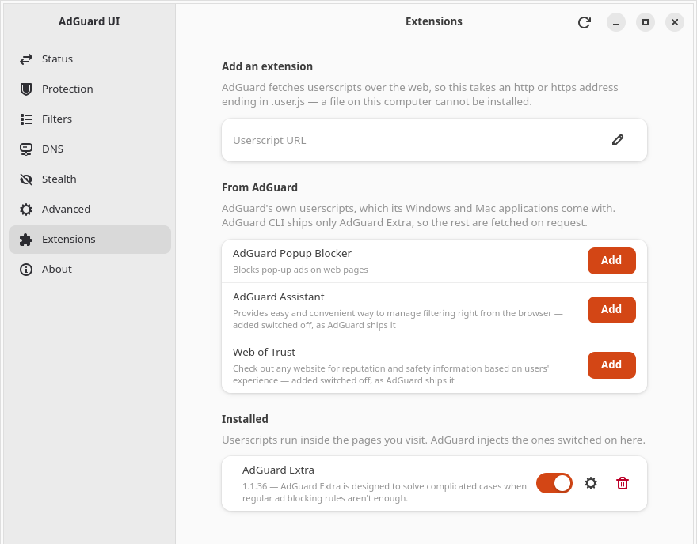

# Changelog

Notable changes per release. Versions are [semantic](https://semver.org/); the
public surface this promises against is the application's own behaviour and its
packaging, not any Rust API — the three crates are internal and are not
published to crates.io.

There is no `changelog.Debian.gz` in the `.deb`, on purpose: that file is for an
archive upload and this package is not built for one (`docs/building.md` §5).
This file is the one changelog.

---

## Unreleased

### An Extensions page, for the userscripts AdGuard runs

Asked for in [#9](https://github.com/dominik-najberg/AdGuard-UI-Linux/issues/9),
carrying feedback from **Aggressive_Bad_7344**: a place to see the installed
userscripts, switch each on and off, add one, and remove one. It is the fourth
feature here to arrive from outside, and the first that reverses a decision this
project had taken twice.

**Userscripts were out of scope, on a fact that stopped being true.** Both
earlier decisions rested on AdGuard's own statement — still in the shipped
`proxy.yaml` — that only AdGuard Extra is supported: one switch, for one script,
that ships already enabled. A page for that is navigation without content, and
the scope note said to re-check when AdGuard CLI moved. It has. Measured against
1.4.13, arbitrary third-party userscripts install and run alongside AdGuard
Extra, so the page has an unbounded list of things you chose, which is what makes
it a page.

Each row carries the script's name and, where the metadata has one, its version
and description — read from the userscript's own metadata file rather than from
`adguard-cli userscripts list`, which prints neither. Names and descriptions are
localised where the script supplies translations, in the same way filter names
already are. Beside each row: a cog with **Homepage** and **Reinstall**, and a
trash behind a confirmation that names the URL the script came from, because that
URL is the only way back.

**Reinstall says what it will do before doing it.** Re-installing is how a
userscript is updated, and it also switches a disabled script back on — measured,
with no way to ask it not to. So the confirmation mentions that, and only when it
applies.

**One row cannot be used, and says so instead of pretending.** AdGuard matches a
userscript by substring against every installed script's name and id, with no way
to be more exact, so a script whose id is contained in another's cannot be
switched or removed at all — not from here, and not from a terminal. Where that
happens the row still shows the script and its state, takes a warning icon, and
explains that the collision is what is in the way; its switch, trash and cog are
all inert rather than offered and then failing. This is AdGuard's limit rather
than the application's, and the row says which.

**AdGuard's own four are offered without you having to find them.** AdGuard for
Windows and Mac come with four userscripts — Extra, Popup Blocker, Assistant and
Web of Trust — where AdGuard CLI ships only Extra. A *From AdGuard* group lists
whichever of them you do not have, with an **Add** button each, and adds them in
the state AdGuard's own applications use: Extra and Popup Blocker switched on,
Assistant and Web of Trust switched off. A script you already have drops out of
that list rather than appearing twice, so an empty group means you have all
four.

**Nothing is installed unless you press Add.** A userscript runs inside the
pages you visit, and this application does not fetch or run one on its own
initiative any more than it performs a privileged operation on its own. The
addresses are AdGuard's, over https, and the versions come from whatever AdGuard
is serving rather than from a list here — their URLs are channels, so they stay
current on their own.

**Adding one takes a web address.** AdGuard installs userscripts only over http
or https — a file on your computer is refused, unlike a custom filter list, which
can be added from a path — so the group says so above the field rather than
letting a paste fail with a message that explains nothing.

Switching a script on or off in a terminal moves the row here, like every other
setting this application watches: a userscript is enabled precisely when
`proxy.yaml` lists it, so that file is the state rather than a copy of it.

Nothing here reads, runs, or vouches for a userscript's code. **Edit** and
**Storage**, which AdGuard for Windows offers in the same menu, are deliberately
absent: each is a feature in its own right, and neither is something this
application has any other reason to contain.

### The removal button now greys its own row while it asks

Found by reading the code rather than reported
([#5](https://github.com/dominik-najberg/AdGuard-UI-Linux/issues/5)): the trash
button on a custom filter list asked *Remove this filter list?* without greying
anything out first, so nothing on the row stopped a second click landing in the
moment before the dialog appeared. Two clicks fast enough — a physical
double-click, not anything anyone does on purpose — opened two dialogs for the
same list, and answering both left a *Filter not found* toast behind an
otherwise successful removal.

**Nothing could ever be lost by it, and it is listed here as tidiness rather
than as a data-loss fix.** AdGuard never reuses a filter's id, so the second
command had nothing left to delete and could only be refused; what it cost was a
duplicated dialog and a toast that read like a failure.

The row now goes insensitive the moment the button is pressed and stays that way
until the question is answered — the switch and the trust padlock with it, so
nothing else can be started against a list that is already being asked about.
Cancelling puts the row straight back, and confirming leaves it grey for the
length of the removal, as before. That is what every other control on this page
already did, and this was the one that did not.

---

## 1.4.0 — 14 August 2026

### The window remembers how big it was

Asked for from the outside ([#3](https://github.com/dominik-najberg/AdGuard-UI-Linux/issues/3)): the
window opened at 880×720 every time, so anyone who preferred it a different
shape resized it again at every launch. It now opens at the size you last left
it, maximized if that is how you left it.

The size is written to `~/.local/state/adguard-ui/window.state` — ours, not
AdGuard's. Nothing about your configuration is in it, and deleting it puts the
window back to 880×720. It is a plain text file with three keys in it and a
comment saying what it is for, because the person who finds it will have gone
looking for exactly that.

It is saved as you resize rather than on the way out, and that is a measured
choice rather than a careful-sounding one: a `SIGTERM` — a logout, a session
ending — emits none of the signals a window would, so an application that saved
only when asked to quit would lose the whole session's resizing at the moment
you could least explain what happened to it. The two exits that *are* signalled,
closing the window to the tray and *Quit* in the tray menu, write it immediately
rather than waiting for the pause after a resize to elapse.

**The position is not remembered, and it is worth saying plainly that it never
will be.** The request asked for the location too, best-effort, on the
understanding that some desktops allow it. None do. GTK4 removed the calls that
move a window and read where it is, and put nothing in their place; Wayland
gives an application no way to ask where its own window is, because placement
belongs to the compositor there. This is not something the toolkit has yet to
add — it is a boundary, and an application that stored coordinates would be
storing numbers it could never use. What the release notes for a future GTK
would bring is the compositor restoring the window itself, with the application
storing nothing.

A saved size is checked before it is used. One larger than any display attached
right now — a laptop that spent yesterday on a wide desk — is cut to fit rather
than discarded, so the window comes back as big as the screen allows. A file
that is truncated, edited into nonsense, absurdly large, or written by some
later version keeps whatever is still legible in it and falls back per key for
the rest. There is no state a file can be left in that opens the window somewhere
you cannot reach it.

Under `--background` the window is built and never shown, and nothing is written
in that case: a window nobody has seen has no opinion about how big it should be.

---

## 1.3.0 — 13 August 2026

### An About page, with a manual update

Asked for from the outside ([#4](https://github.com/dominik-najberg/AdGuard-UI-Linux/issues/4)): a
way to update AdGuard's filters and check for a new version without opening a
terminal. It arrives as a new **About** page, last in the sidebar, which also
gives the application somewhere to show two things it had never shown at all —
its own version and the AdGuard CLI's, with the path the CLI was found at.

One button updates the filter lists, DNS filter lists, userscripts, Safe
Browsing data and certificate revocation data, and asks whether a newer AdGuard
CLI has been released. Each component is reported in AdGuard's own words. There
is deliberately no summary count: Safe Browsing and certificate revocation
answer *Updated* on every run of a working install, so a count would read the
same forever while appearing to describe your machine.

A component that fails says so and invites another attempt, which is what the
measurements support — failures were common and cleared on the next run every
time. The Filters and DNS pages are re-read when their catalogues actually
moved.

A row above the button says when new filter data last arrived, read from the
filter databases rather than fetched. It says *changed* rather than *checked* on
purpose: AdGuard's daemon refreshes on its own every few hours, and the
timestamp behind the row moves only when something actually came down — so a
long gap means the lists have not been revised, not that nothing has looked.
This is why there is no check-on-launch setting: it would re-do at every launch
what the daemon did a few hours earlier, and under `--background` it would fire
at login with no window to report into.

A second button checks whether a newer **AdGuard UI** has been released, which
nothing in the application could tell you before — the version row was a string
with nothing behind it. It is the only request this application makes of its
own, so the group discloses that above the button: it asks github.com, it names
the application and its version, and it carries nothing about you or the
machine. It happens only when pressed — never at launch and never on a timer —
and it reports rather than installs, because releases are a `.deb` and a tarball
with no apt repository behind them.

The client uses the platform certificate verifier rather than bundled roots, and
that is measured rather than idiomatic: on a machine filtering system-wide,
AdGuard intercepts this very connection and re-signs it with its own CA, which
lives in the system trust store. Bundled roots would fail on exactly the
machines this application is for.

**An available application update is reported, never installed.** Updating
AdGuard replaces its privileged helper, and this application performs no
privileged operation of its own, so it names `adguard-cli update` and leaves
running it to you. Automatic checks and a tray entry are both deliberately out
of scope; the issue records why.

### Trusted custom filters, as a control on the row

Asked for from the outside ([#2](https://github.com/dominik-najberg/AdGuard-UI-Linux/issues/2)): a
custom filter list's *trusted* state was visible in the catalogue and changeable
from a terminal, and nowhere in this application. Trusting a list lets it run
scriptlets in the pages you visit — script chosen by whoever writes the list —
so it is the one setting here that hands a third party something.

- **A padlock between the switch and the trash**, on custom HTTP rows and
  nowhere else. The row already had to keep *off* and *gone* apart, which is why
  removal is a suffix button rather than a gesture; trusted is a third outcome
  and gets a third shape. It is a plain button, not a toggle: a toggle's state
  moves under your finger, so the row would read *trusted* for the length of a
  dialog you might then cancel.
- **The trusted state is legible without hovering** — a warning icon in the
  margin and a sentence under the name saying what the list may do. That
  sentence displaces the list's own description for as long as trust is granted,
  which is how the Protection page already resolves the same competition.
  Untrusted rows are unchanged and say nothing: that is the default, and forty
  rows announcing it would bury the one row that is not.
- **Granting trust is confirmed and withdrawing it is not.** A dialog in front
  of the safe direction is one you learn to click through before reaching the
  one that matters. Cancel is the default and the escape route.
- **DNS lists and catalogue filters do not get the control**, for three
  different measured reasons — `adguard-cli dns filters` has no `set-trusted`
  subcommand at all, AdGuard refuses a catalogue filter itself, and the
  user-rules row is a trap: the CLI *accepts* it and really writes, which would
  silently stop the scriptlet and HTML rules in your own `user.txt` from being
  applied. That last one is refused before the command is ever run.

**A change takes effect at the next restart, and the dialog says so.** Measured
for this release: AdGuard reads the flag when the proxy starts and not again —
in both directions. Granting trust to a running proxy is inert until it
restarts, and **so is taking it back**, which means a list you have just
distrusted keeps running its scriptlets until then. The CLI reports none of
this, so a successful change raises *"Restart the proxy to apply this change"* —
the sentence the Protection and Advanced pages already use — while the proxy is
up. An earlier draft of the dialog promised trust "can be withdrawn at any
time"; it was written before anyone measured it, and it was wrong.

---

## 1.2.0 — 4 August 2026

### Start at login, as a switch

Asked for from the outside: an option to start with the session, writing a
`.desktop` file into `~/.config/autostart`, with a flag that keeps the main
window closed.

The flag was already there. `adguard-ui --background` has registered the tray
and presented no window since 1.0, and it is what the entry in
`data/autostart/` — installed by `packaging/tarball.sh --autostart` — has been
running at login all along. What was missing was a way to install that entry
without a terminal, so that is what this adds:

- **Start at login**, at the foot of the Advanced page. Switching it on writes
  `~/.config/autostart/io.github.dominik-najberg.AdGuardUI.desktop`; switching
  it off deletes it. The name is the one the packaging already installs, so the
  switch, the shipped entry and whatever a startup-applications editor lists are
  all one file — disable it out there and the switch reads off, and the row
  re-reads itself every time the window is focused.
- **The entry runs this binary's own path**, not the bare `adguard-ui` that the
  shipped example resolves against `$PATH`. A session manager's `$PATH` need not
  include `~/.local/bin`, where the per-user install puts things, and an entry
  it cannot resolve fails at login with nothing on screen to say so.
- **The row says when a background start would have nowhere to appear.** With no
  tray icon — GNOME without an AppIndicator extension — `--background` leaves
  the application unreachable and exits instead, which is the one place a tray
  that will not register is fatal. The window knows whether the tray registered,
  so the switch says so beside itself rather than leaving it for the journal.

- **It is reported on the Status page too**, as a read-only row at the foot that
  leads to the switch. That page answers *am I protected?* and owns no settings,
  so it reports and links rather than offering a second control — and the group
  it sits in says plainly that this is about the window and the tray icon, since
  a row reading "Start at login — No" on that page invites exactly one wrong
  conclusion.

No new flag: `--silent` and `--quiet` would have been synonyms for
`--background`, and one behaviour with three names is one more thing to keep in
step. This switch neither starts nor stops AdGuard's protection: what runs the
proxy at login is AdGuard's own arrangement, not this.

### The Annoyances group could not be switched on at all

Reported from the outside: the five `AdGuard …` annoyance filters could not be
enabled from the application, which showed *"Please read carefully before
enabling Annoyance filters"* and then never showed anything to read. The
workaround was to enable them in a terminal and accept there.

AdGuard's CLI gates that group behind an agreement typed at a prompt, and this
application runs it with stdin closed so that every prompt takes its default
([`docs/cli-contract.md`](docs/cli-contract.md) §7). That is right for every
other prompt the CLI has and wrong for this one, which does not take a default —
it refuses the work. Three things were wrong and all three are fixed:

- **The agreement is now shown and answered.** Switching on a list from the
  Annoyances group opens a dialog carrying AdGuard's own wording verbatim, and
  agreeing sends the answer through to the CLI. Declining leaves the switch off
  and nothing is run — the question comes *before* the command, because
  `filters add` subscribes to a list before refusing to enable it, so asking
  afterwards would have left the subscription behind.
- **A silent half-success is now reported.** `filters add` prints
  `Filter […] added` before it refuses, which the wrapper's success check
  accepted — so the first click on one of these lists really did subscribe to
  it, left it switched off, and said only *"Could not enable …"*.
- **The gate is eleven lists, not five.** Measuring the whole catalogue found
  `Fanboy's Annoyances`, `Web Annoyances Ultralist`, `Adblock Warning Removal
  List`, `EasyList Cookie List` and two more gated identically — while
  `CJX's Annoyances List`, which has the word in its title but sits in
  Language-specific, is not gated at all. The check is by catalogue group, and
  it is per-set: group 4 of the DNS catalogue is *Security*, and testing the
  number bare would have put a dialog about violating websites' terms of use in
  front of the DNS malware lists.

---

## 1.1.0 — 2 August 2026

Settings that existed in `proxy.yaml` and on no page, traffic capture, and
backup and restore. Ten slices of work, none of which changes anything 1.0.0
already did — which is why this is a minor release. "v2" in this project's
documentation is a scope word and not a version number
([`docs/architecture.md`](docs/architecture.md) §7).

### The settings that were in the file and not on a page

An enumeration taken on 2 August 2026 walked every leaf key of `proxy.yaml`
against every key the pages can actually reach — mechanically, so the two sides
could not drift the way a retyped list does. It found **80 keys in the file, 58
rendered somewhere, 22 not**. Seven of the 22 should stay unrendered and two
belonged to the traffic-capture work below, which left eleven rows worth
building; all eleven are here. **At this release 71 of the 80 keys are
rendered**, and `docs/architecture.md` §5 carries the enumeration and the reason
for each of the nine that are not.

- **HTTPS filtering** (Advanced) — five switches: EV-certificate sites, TLS 1.3,
  OCSP, Certificate Transparency and HTTP/3. One group description carries their
  shared dependency on HTTPS filtering being switched on, rather than five
  separate markings saying the same thing five times.
- **Browser compatibility** (DNS) — blocking Encrypted Client Hello, last on the
  page because `proxy.yaml`'s own comment says the common case is to leave it
  alone. Its subtitle covers three states, including that it does nothing at all
  while DNS filtering is off — a combination the CLI will happily create.
- **Privacy** (Protection) — the anonymous-statistics consent. **The first row
  this application ships that it cannot describe**: `proxy.yaml`'s comments, the
  CLI's help and the binary's own strings document nothing about what the key
  sends, so every state of the row says so rather than inventing a payload.
- **Diagnostics: response tagging** (Advanced) — the `X-Adguard-Filtered` and
  `X-Adguard-Rule` headers. They are added to **responses**, so the sites you
  visit never receive them; the row says which direction it is, because the
  intuitive reading is the wrong one.
- **Filtered ports** (Advanced) — the port list, directly above *Manual proxy
  ports* and worded to mirror it. The one row that checks the value before
  writing instead of letting the CLI word its own refusal, because this key's
  refusal recommends the very form it rejects.
- **Outgoing connections** (Advanced) — the outbound interface, in its own group
  after *Listen address* so the page reads incoming and then outgoing. It binds
  every outgoing connection rather than only outbound-proxy traffic, which is
  why it is not filed under *Outbound proxy*. Empty is a real setting here and
  means the system decides.
- **Automatic language filters** (Filters) — on the Filters page, above the
  catalogue it writes to, because a user who finds a filter switched on that
  they never switched on is looking at that page. Its subtitle is a measurement:
  the automatic add keys on whether a list is installed, so a list you switched
  off stays off, while a list you removed comes back switched on.

### Two things 1.0.0 listed as out of scope, now built

- **Traffic capture** (Advanced) — the HAR switch and its folder, in a group
  whose description is the feature: capture records response bodies, the files
  are world-readable, and a measured run produced 114 MB in six minutes, one
  file per run, with nothing pruning them. It ships switched off, which is what
  answers the "too heavy for an always-on UI" objection that kept it out of
  1.0.0. A leading `~` in the folder is expanded before the write; the CLI
  stores it literally.
- **Backup and restore**, in two halves. *Export settings* and *Restore
  settings* sit in their own group at the foot of Advanced, and *Export logs*
  sits beside the log level that decides what goes into it. Three of the strings
  exist to forbid an obvious assumption: a round trip **loses DNS filter choices
  and DNS user rules**, because only `proxy.yaml` is exported; a restore leaves
  the **licence and the certificate untouched**; and the logs bundle **includes
  your configuration and not your browsing record**. A chosen archive is
  identified before anything is offered, so a logs bundle is refused with an
  explanation rather than handed to the importer — which would accept it at exit
  0 and half-replace the install. Export asks for a folder rather than a
  filename, so there is no ambiguity about an existing path.
- **Restore from a backup at first run** is the second half, and it is offered
  in **every** branch of the assistant including the two that otherwise refuse
  to set anything up: importing settings is not licence-gated where seeding a
  configuration is, so a restore is reachable by exactly the user that screen
  turns away. It does not hand over the window silently the way a completed
  setup does — it ends on a screen naming what a backup cannot carry: the
  licence, the certificate while the restored configuration says HTTPS filtering
  is on, and the DNS selections.

### Known limits at 1.1.0

- **The activation success leg is still unmeasured**, unchanged from 1.0.0 and
  for the same reason: watching it needs a real account and spends a device slot
  ([`docs/handoff.md`](docs/handoff.md) §3 item 6).
- **A headless GUI run under a sandboxed data directory can stop a running
  proxy.** Measured on 2 August 2026 from the daemon's own log rather than
  inferred — three clean shutdowns, each within about a second of such a start.
  Six launches against the real data directory did not reproduce it, so this
  looks like a property of the test sandbox rather than of ordinary use, but
  which part of the GUI does it is still not established; recovery is
  `adguard-cli start`. This predates the release: it is the cause of outages two
  earlier sessions recorded as unexplained, and what is new is the measurement,
  not the behaviour ([`docs/handoff.md`](docs/handoff.md) §3 item 11).
- **Userscripts, live blocked-request stats and the `speed` benchmark remain out
  of scope**, each for a recorded reason (`docs/architecture.md` §7). HAR capture
  and import/export were on that list at 1.0.0 and have come off it.
- **A tray icon still needs an AppIndicator extension** — GNOME has no native
  tray. Without one the application prints a line to stderr and runs windowed.

## 1.0.0 — 1 August 2026

First release. Everything below has been in the tree for some time; what is new
on this date is that it is tagged, packaged and downloadable.

### The pages

- **Status** — runtime state, start / stop / restart, the proxy endpoints and the
  licence. Polled every 2 s while the window is up, every 10 s when only the tray
  is showing.
- **Protection** — the six protection modules, each one switch over one key in
  `proxy.yaml`.
- **Filters** — AdGuard's own catalogue read from its SQLite databases with
  localised names, plus custom lists installed by URL and removed behind a
  confirmation that names the list.
- **DNS** — the DNS filter catalogue, your own DNS rules, the three server
  settings, and the local DNS proxy's listen port as disabled / automatic /
  fixed.
- **Stealth** — the 26 tracking-protection settings behind Protection's stealth
  switch, including the nested anti-DPI section.
- **Advanced** — proxy mode, ports, listen address and authentication, outbound
  proxy, worker threads, log level and secure DNS filtering. A setting whose
  effect depends on another setting says so rather than appearing to work.
- **First-run assistant** — for a machine with no `proxy.yaml` at all: the licence
  check, one guarded `configure` to seed a configuration, four questions, and
  then the pages above.

### Around the pages

- **A tray icon** carrying start / stop and the six protection toggles, in the
  GUI process rather than a second executable — so a tray toggle and the switch
  on the Protection page are the same write and cannot disagree.
- **Licence activation**, user-driven: `activate` hands back a link, and a
  *finish activation* button re-runs it. Never polled.
- **External edits reconcile live.** A monitor on `proxy.yaml` repaints the
  table-driven pages when the file moves, without churning on the application's
  own CLI traffic, and raises a toast only when a row you can actually see moved.
- **`--background`** registers the tray and presents no window, which is what the
  autostart entry runs at login. A second launch activates the running copy
  rather than starting a rival writer.

### The three prerequisites it detects and will not perform

The certificate that HTTPS filtering signs with, AdGuard's root helper, and the
browser-integration manifests are each detected, named, and paired with
**AdGuard's own command** and a copy button. All three re-read themselves when
the window regains focus. This application ships no privileged component: no
`sudo`, no `pkexec`, no setuid bit set on anything (`docs/architecture.md` §6).

### Packaging and distribution

- `make package` builds a `.deb` and a tarball for `~/.local`; neither build step
  needs root, and only `make install` asks for a password.
- The `.deb`'s `Depends:` is derived by `dpkg-shlibdeps` rather than written
  down, which is what keeps it installable on Ubuntu 24.04 through 26.04 rather
  than only on the machine that built it.
- Tagging `v1.0.0` builds both packages in an `ubuntu:26.04` container and
  attaches them, with checksums, to the GitHub release
  ([`.github/workflows/release.yml`](.github/workflows/release.yml)).

### Known limits at 1.0.0

- **The activation success leg is unmeasured.** Everything up to the browser
  log-in is proven, including against a real unlicensed install; what nobody has
  watched is the leg after a genuine log-in, because it needs a real account and
  spends a device slot (`docs/handoff.md` §3 item 6).
- **Userscripts, live blocked-request stats, HAR capture, the `speed` benchmark
  and import/export are out of scope**, each for a recorded reason
  (`docs/architecture.md` §7).
- **A tray icon needs an AppIndicator extension** — GNOME has no native tray.
  Without one the application prints a line to stderr and runs windowed.
