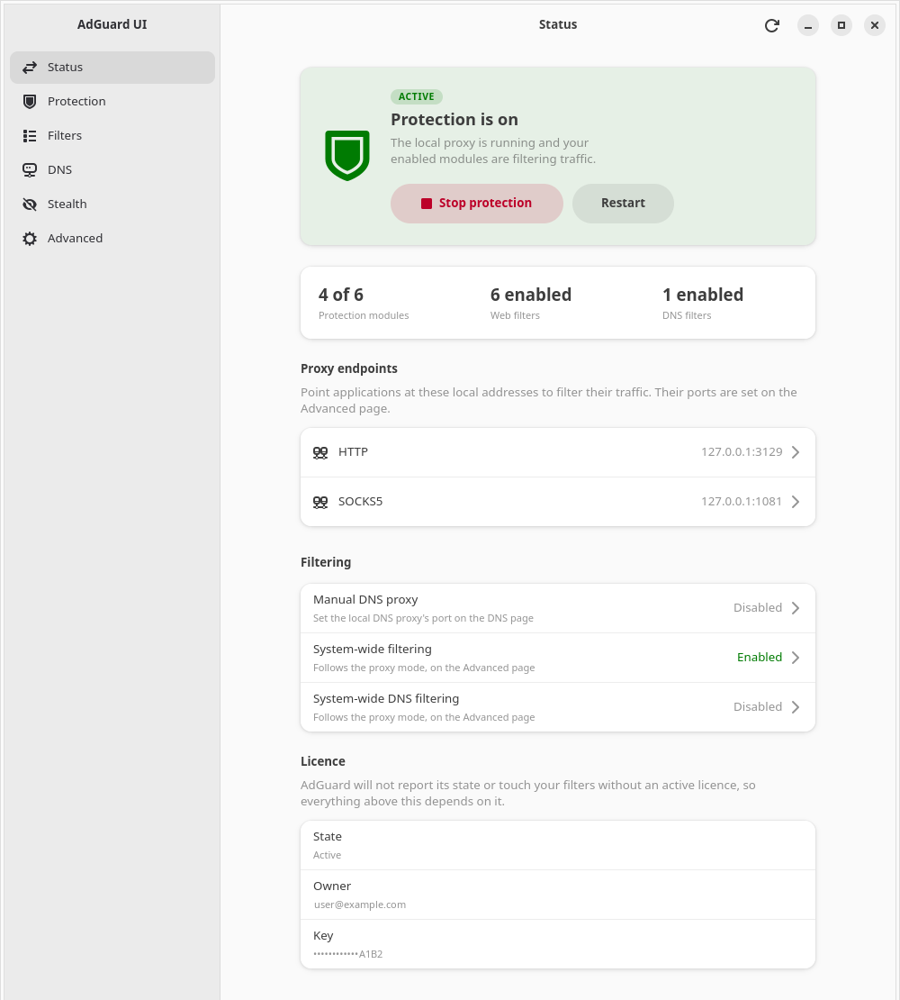
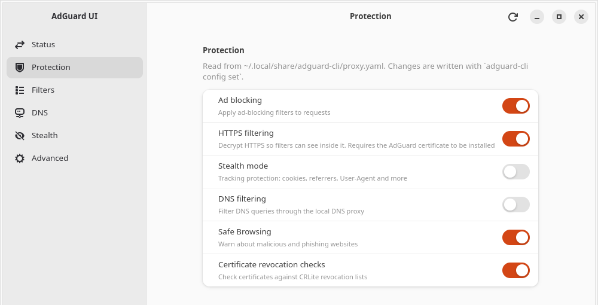
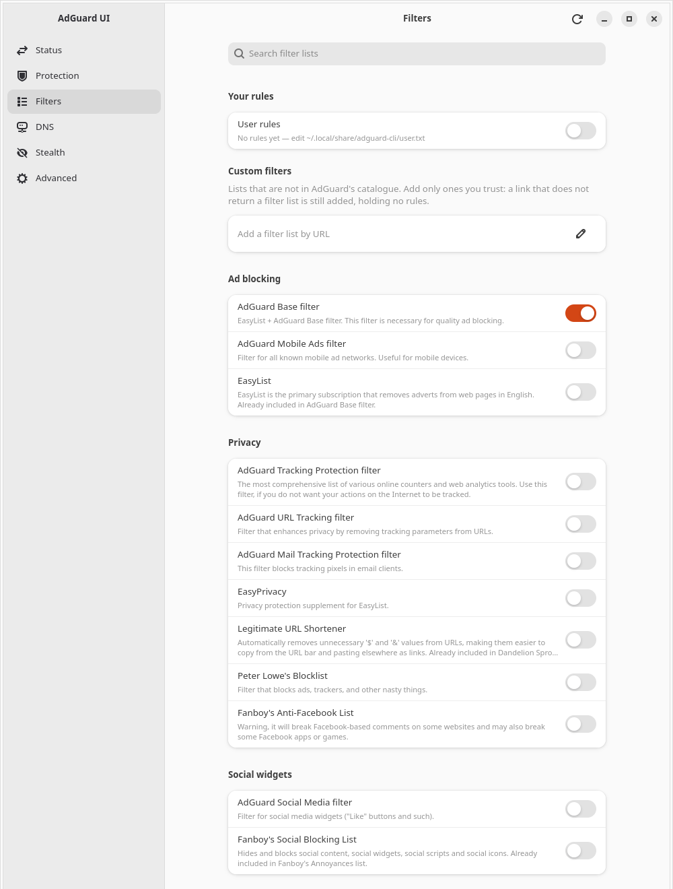
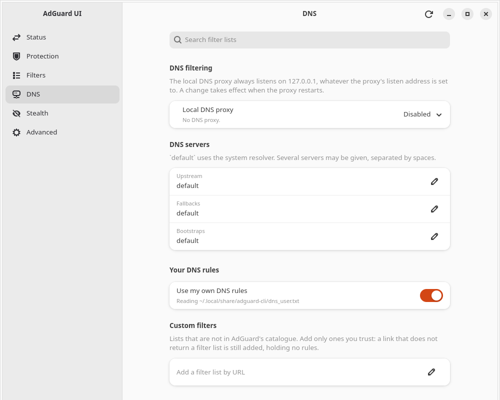
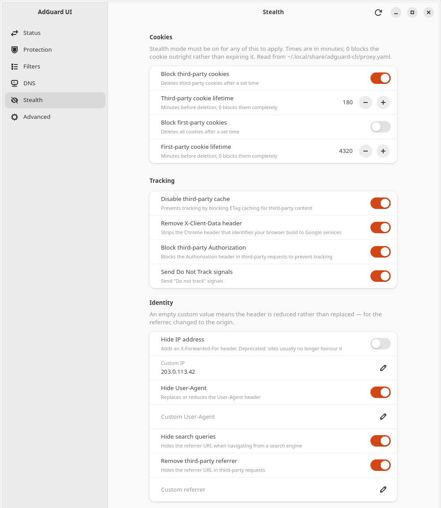
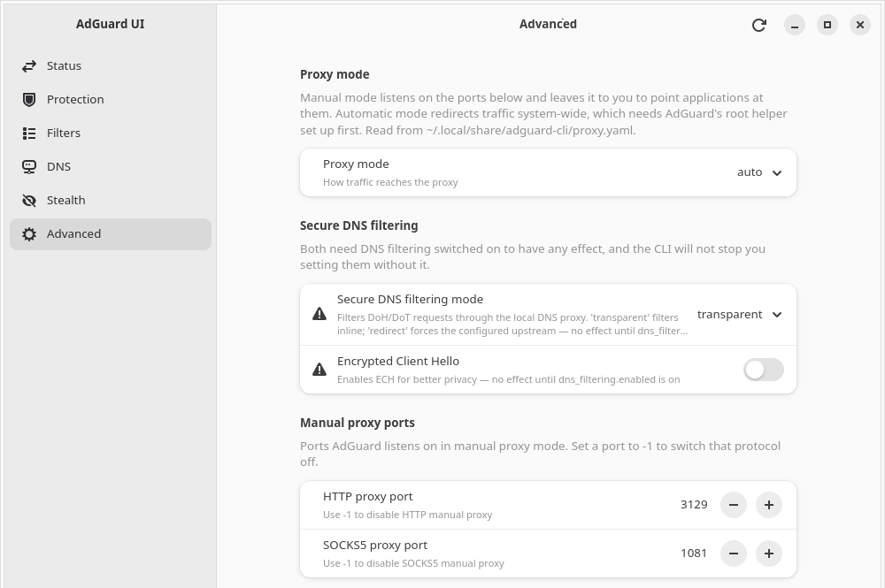
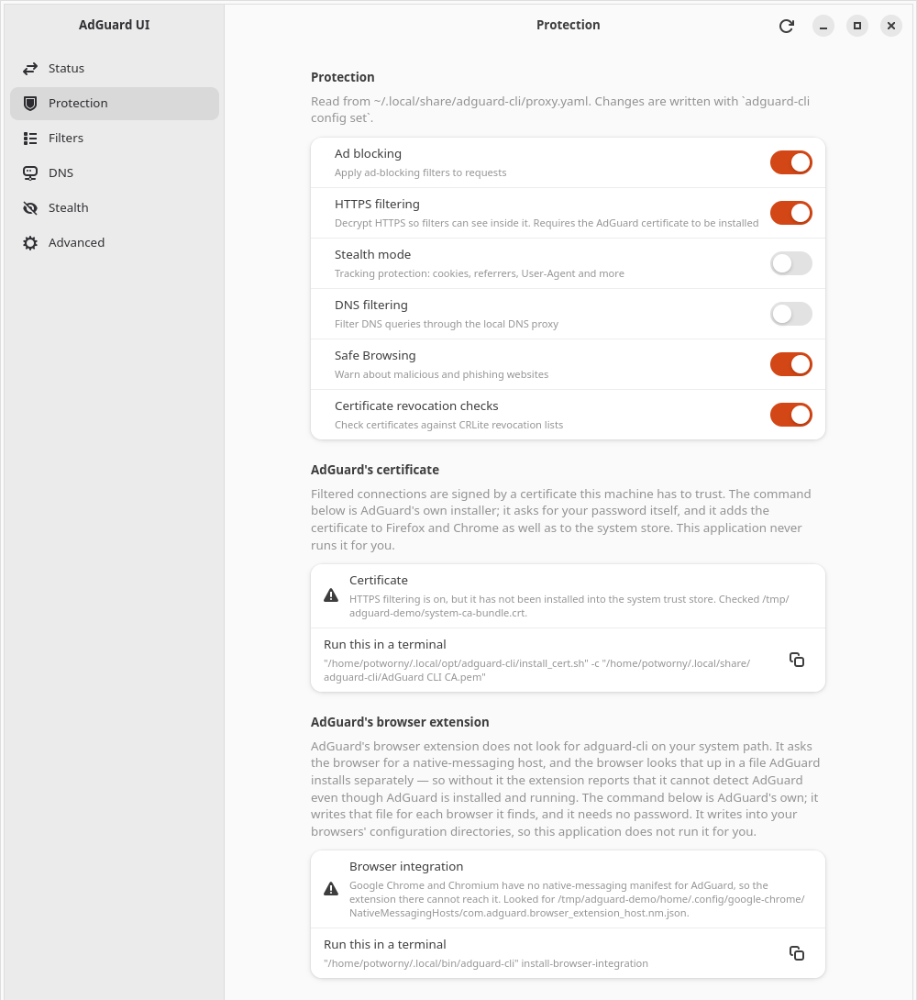

# AdGuard UI for Linux

A GTK4 / libadwaita desktop front-end for **AdGuard CLI** on Linux — an unofficial, third-party GUI for a command-line product that ships without one.

It is a plain user-session application: no daemon, no background service of its own, and no privileged component. Settings are read from AdGuard's own files and written back through `adguard-cli config set`, so the CLI stays the only thing that edits your configuration.



---

## Requirements

| | |
| --- | --- |
| **AdGuard CLI** | Installed and licensed. Not bundled here, and nothing works without it — measured against 1.4.13. |
| **GTK4 / libadwaita** | GTK 4.10+, libadwaita 1.7+. Developed against GTK 4.22 and libadwaita 1.9 on Ubuntu 26.04, GNOME 50, Wayland. |
| **Rust** | 1.85+ to build from source. |
| **A tray icon** | Needs an AppIndicator extension — GNOME has no native tray. Without one the app prints a line to stderr and runs windowed. |

AdGuard CLI is a third-party install under `$HOME`, so no package can declare a dependency on it. The application looks for `adguard-cli` on `$PATH`, then in `~/.local/bin` and `~/.local/opt/adguard-cli`, and renders an explanation rather than failing if it finds none.

## Install

Build a package and install it — building needs no root, only the install step does:

```bash
make install
```

That builds `target/package/adguard-ui_<version>_<arch>.deb` and installs it with `apt`. To build the packages without installing anything, `make package` writes both the `.deb` and a tarball for `~/.local`; the tarball carries an `install.sh` that never asks for a password, and `--list` prints the files it would write without writing any. Removal is `sudo apt-get remove adguard-ui`.

From source:

```bash
cargo build --release --workspace
```

`adguard-ui` is the only binary — it serves the window and the tray icon both. Full instructions, including the per-user install and what each packaging step does, are in [`docs/building.md`](docs/building.md).

## Running

```bash
adguard-ui
```

```bash
adguard-ui --background
```

`--background` registers the tray and presents no window, which is what the autostart entry in `data/autostart/` runs at login. Launching the application again activates the running copy instead of starting a second one — two copies would be two writers to `proxy.yaml`.

While the tray is present, closing the window only hides it and *Quit* in the tray menu exits. If the tray could not register, closing quits as usual, so there is no way to end up with a hidden application you cannot reach.

---

## The pages

**Status** — runtime state, start/stop/restart, the proxy endpoints, and the licence. Polled every 2 seconds while the window is up, every 10 when only the tray is showing.

**Protection** — the six protection modules, each one switch over one key in `proxy.yaml`.



**Filters** — AdGuard's own catalogue, read from its SQLite databases with localised names, plus custom lists installed by URL. The group description says what AdGuard's own content check does and does not catch: a link that answers with something other than a filter list is still installed, holding no rules.



**DNS** — the DNS filter catalogue, your own DNS rules, the three server settings, and the local DNS proxy's listen port as disabled / automatic / fixed.



**Stealth** — the 26 tracking-protection settings behind Protection's stealth switch, including the nested anti-DPI section.



**Advanced** — proxy mode, ports, listen address and authentication, outbound proxy, worker threads, log level, and secure DNS filtering. Settings whose effect depends on another setting say so rather than appearing to work.



A **first-run assistant** covers the other end: on a machine with no `proxy.yaml` at all it checks the licence, seeds a configuration with one guarded `configure`, asks four questions, and writes the answers before handing over to the pages above.

## Prerequisites it detects, and will not perform for you

Three things an AdGuard install needs are outside `proxy.yaml`, and every stock install starts without them: the certificate that HTTPS filtering signs with is not in the system trust store, the root helper that automatic mode and the HTTP proxy depend on ships without its setuid bit, and the native-messaging manifests the browser extension resolves are not written until you ask for them.

Each is detected, named, and paired with **AdGuard's own command** and a copy button. The application never runs them — no `sudo`, no `pkexec`, no privileged binary of its own, and no setuid bit set on anything. The reasoning is in [`docs/architecture.md`](docs/architecture.md) §6; the short version is that the helper lives in a directory you can write to, so conferring root on it from behind a GUI button is a different act from typing `sudo` at a prompt.



The browser check is the one whose answer something unrelated to AdGuard can invalidate: install a browser after the integration command last ran and it is silently left out, with the extension reporting that it cannot find AdGuard at all. All three re-read themselves when the window regains focus.

> Every check above is in its *met* state on the machine these screenshots came from, so the unmet frame was produced with the documented `$ADGUARD_CA_BUNDLE`, `$SYSTEM_CERT_DIR` and `$ADGUARD_BROWSER_HOME` overrides ([`docs/building.md`](docs/building.md) §3), pointing the checks at an empty sandbox rather than at this machine's real trust store. The licence owner, the visible tail of the licence key and the Stealth page's custom IP are placeholders; everything else is as rendered.

---

## How it works

**Reads come from files, writes go through the CLI.** `config show` masks secrets and folds sections, and the `filters list` table overflows its columns on long titles, so the pages read `proxy.yaml` and the filter databases directly for exact values. Nothing here writes YAML: `proxy.yaml` is half explanatory comments, and rewriting it would strip the documentation you rely on. Every write is an `adguard-cli config set`, re-read afterwards — its success message prints for a no-op and for a silently declined change alike.

**External edits reconcile live.** A file monitor watches `proxy.yaml` and repaints the table-driven pages when it moves, without churning on the application's own CLI traffic — every `adguard-cli` invocation rewrites that file whether or not a byte changes. A toast appears only when a row you can actually see moved.

**One process owns everything.** The tray is a library inside the GUI process, not a second executable, so a toggle in the tray menu and the switch on the Protection page are the same write and cannot disagree.

## Documentation

| | |
| --- | --- |
| [`docs/building.md`](docs/building.md) | Prerequisites, build, install, packaging, and every verification recipe including the headless ones. |
| [`docs/architecture.md`](docs/architecture.md) | Crate layout, refresh and reconcile, threading and startup, the pages, privileged operations, scope. |
| [`docs/cli-contract.md`](docs/cli-contract.md) | Measured `adguard-cli` behaviour that the code depends on — the reference for anything touching the CLI. |
| [`docs/handoff.md`](docs/handoff.md) | Where the project stands, what was decided, what is still open. |

## Tests

```bash
cargo test --workspace
```

218 tests pass and 44 are `#[ignore]`d. The ignored suites drive the real `adguard-cli`: two write only to a throwaway `$XDG_DATA_HOME`, and two mutate this machine's real configuration and restore it afterwards. [`docs/building.md`](docs/building.md) §3 says which is which before you run one.

CI runs the first of those commands on every push and pull request, in an `ubuntu:26.04` container — the runner's own image ships a libadwaita too old to build against. It runs no formatter check and never the ignored suites; [`.github/workflows/ci.yml`](.github/workflows/ci.yml) says why for each.

The tree is hand-formatted and `cargo fmt --check` is deliberately dirty — the measured-behaviour tables in `config.rs`, `cli.rs` and `model.rs` do not survive rustfmt.

## Licence

GPL-3.0-or-later, as declared in `Cargo.toml`. The full text is in [`LICENSE`](LICENSE).

AdGuard and AdGuard CLI are products of AdGuard Software Ltd. This project is an independent front-end and is not affiliated with or endorsed by them.
